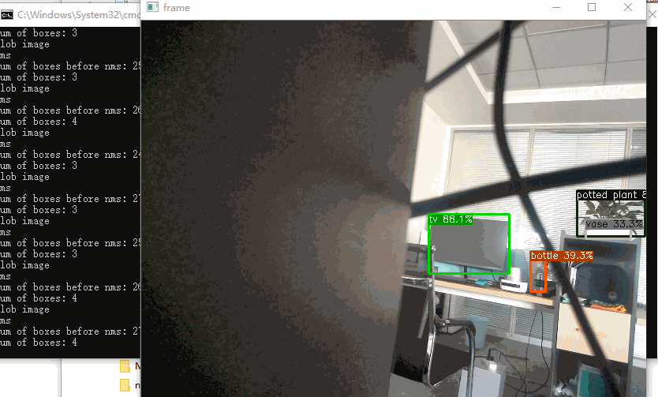

# YOLOX-TensorRT(8.2.0.6) in webcam

The repo is a complement to the official repo. There are three differences:

- Windows 10
- TensorRT 8.2.0.6
- Webcam





## Step 1: Prepare serialized engine file

Follow the trt [python demo README](https://github.com/Megvii-BaseDetection/YOLOX/blob/main/demo/TensorRT/python/README.md) to convert and save the serialized engine file.

Check the 'model_trt.engine' file generated from Step 1, which will be automatically saved at the current demo dir.


## Step 2: build the demo

Please follow the [TensorRT Installation Guide](https://docs.nvidia.com/deeplearning/tensorrt/install-guide/index.html) to install TensorRT.

And you should set the TensorRT path and CUDA path in CMakeLists.txt.

If you train your custom dataset, you may need to modify the value of `num_class`.

```c++
const int num_class = 80;
```

Install opencv with ```sudo apt-get install libopencv-dev``` (we don't need a higher version of opencv like v3.3+). 

build the demo:
## Step 2: build the demo

Please follow the [TensorRT Installation Guide](https://docs.nvidia.com/deeplearning/tensorrt/install-guide/index.html) to install TensorRT.

And you should set the TensorRT path, OpenCV path and CUDA path in CMakeLists.txt.

If you train your custom dataset, you may need to modify the value of `num_class`.

```c++
const int num_class = 80;
```

build the demo:

1. Building the project through cmake -gui.exe
2. Generating yolox.exe from VS  

run the demo:

```shell
yolox.exe ../model_trt.engine -i
```

or

```shell
yolox.exe <path/to/your/engine_file> -i
```


